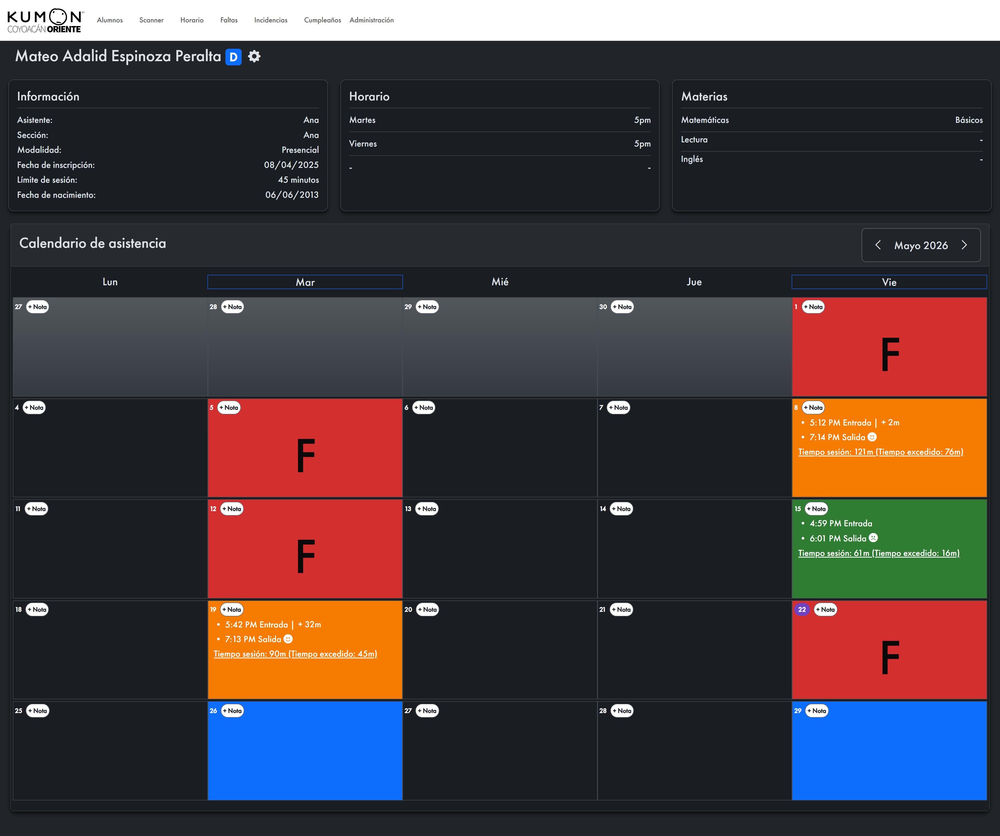

# Perfil del Alumno

Esta sección detalla información de la asistencia del alumno, así como las materias, horarios, fecha de nacimiento, entre otros.&#x20;

***

## Notas

Se puede agregar una nota del día en el perfil del alumno dando click en el botón . Estas notas se podrán visualizar en el apartado de [Incidencias](../incidencias.md).

<figure><figcaption></figcaption></figure>

Cuando un día tiene una nota, aparecerá de esta forma:

<figure><figcaption></figcaption></figure>

***

## Opciones

Se puede editar el perfil del alumno, descargar su QR o eliminarlo, dando click en el botón <i class="fa-gear">:gear:</i>.

<figure><figcaption></figcaption></figure>

***

<figure><figcaption></figcaption></figure>

## Simbología del calendario

<table data-view="cards"><thead><tr><th align="center"></th><th align="center"></th><th data-hidden data-card-cover data-type="image">Cover image</th></tr></thead><tbody><tr><td align="center">Negro</td><td align="center">Día donde el alumno no tiene sesión programada</td><td data-object-fit="contain"><a href="../../.gitbook/assets/image (43).png">image (43).png</a></td></tr><tr><td align="center"></td><td align="center"></td><td></td></tr><tr><td align="center">Azul</td><td align="center">Día donde el alumno tiene sesión programada</td><td data-object-fit="contain"><a href="../../.gitbook/assets/image (42).png">image (42).png</a></td></tr><tr><td align="center">Rojo con F</td><td align="center">El alumno faltó a su sesión o aún no ha registrado su entrada</td><td data-object-fit="contain"><a href="../../.gitbook/assets/image (39).png">image (39).png</a></td></tr><tr><td align="center">Verde</td><td align="center">El alumno registró su entrada dentro del tiempo de tolerancia (-10m)</td><td data-object-fit="contain"><a href="../../.gitbook/assets/image (40).png">image (40).png</a></td></tr><tr><td align="center">Naranja</td><td align="center">El alumno registró su entrada fuera del tiempo de tolerancia (+10m)</td><td data-object-fit="contain"><a href="../../.gitbook/assets/image (41).png">image (41).png</a></td></tr><tr><td align="center">Amarillo</td><td align="center">El alumno registró recogida de material</td><td data-object-fit="contain"><a href="../../.gitbook/assets/image (44).png">image (44).png</a></td></tr></tbody></table>

Además de los códigos de colores, se mostrará información de la hora del registro, así como el estado de ánimo que seleccionó el alumno al registrar su salida, el tiempo de sesión y su excedente, y el tiempo de desfase de la tolerancia de 10 minutos después de registrar su entrada.

<figure><figcaption></figcaption></figure>

